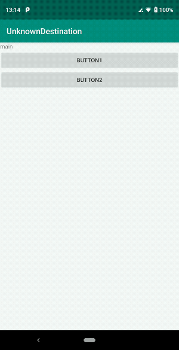

Navigation destination is unknown to this NavController
===

This is minimal project to reproduce a issue.

It is popular to use RecyclerView to transition from list to detail, but in this sample it is simplified using Button instead.

Build the project then you can see two buttons "BUTTON1" and "BUTTON2".
If you clicked these buttons at the same time then app crashed with following error:

```
2019-01-29 13:14:38.915 8561-8561/jp.gcreate.sample.unknowndestination D/test: onClick button 1: before navigate
2019-01-29 13:14:38.933 8561-8561/jp.gcreate.sample.unknowndestination D/test: onClick button 1: after navigate
2019-01-29 13:14:38.951 8561-8561/jp.gcreate.sample.unknowndestination D/test: onClick button 2: before navigate
2019-01-29 13:14:38.952 8561-8561/jp.gcreate.sample.unknowndestination D/AndroidRuntime: Shutting down VM
    
    
    --------- beginning of crash
2019-01-29 13:14:38.959 8561-8561/jp.gcreate.sample.unknowndestination E/AndroidRuntime: FATAL EXCEPTION: main
    Process: jp.gcreate.sample.unknowndestination, PID: 8561
    java.lang.IllegalArgumentException: navigation destination jp.gcreate.sample.unknowndestination:id/action_mainFragment_to_subFragment is unknown to this NavController
        at androidx.navigation.NavController.navigate(NavController.java:778)
        at androidx.navigation.NavController.navigate(NavController.java:719)
        at androidx.navigation.NavController.navigate(NavController.java:705)
        at androidx.navigation.NavController.navigate(NavController.java:837)
        at jp.gcreate.sample.unknowndestination.fragments.MainFragment$onViewCreated$2.onClick(MainFragment.kt:32)
        at android.view.View.performClick(View.java:6597)
        at android.view.View.performClickInternal(View.java:6574)
        at android.view.View.access$3100(View.java:778)
        at android.view.View$PerformClick.run(View.java:25885)
        at android.os.Handler.handleCallback(Handler.java:873)
        at android.os.Handler.dispatchMessage(Handler.java:99)
        at android.os.Looper.loop(Looper.java:193)
        at android.app.ActivityThread.main(ActivityThread.java:6669)
        at java.lang.reflect.Method.invoke(Native Method)
        at com.android.internal.os.RuntimeInit$MethodAndArgsCaller.run(RuntimeInit.java:493)
        at com.android.internal.os.ZygoteInit.main(ZygoteInit.java:858)
```



## Environment

libraries:

- navigation component: 1.0.0-alpha11
- androidx.appcompat: 1.1.0-alpha01
- androidx.fragment: 1.1.0-alpha03

device:

- Essential Product(PH-1)
- Android version: 9

## Link

- <https://issuetracker.google.com/issues/121232303>
- <https://issuetracker.google.com/issues/118975714>
